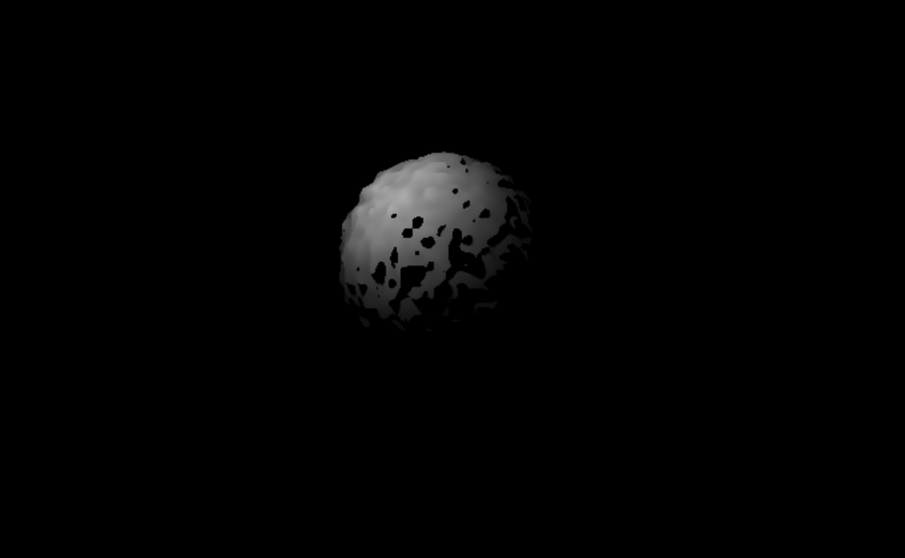

# Raytracing Fractal Demo with WebGL

Welcome to the raytracing fractal demo implemented with WebGL! This project showcases a fractal rendered using raytracing techniques in a WebGL context.

## Description

This project demonstrates a raytracing fractal demo using WebGL. The fractal is rendered in real-time on a canvas element, providing an interactive and visually appealing experience.

## Running the Application

To run this application, follow these steps:

1. Install the dependencies:
   ```
   npm install
   ```

2. Start the development server:
   ```
   npm run dev
   ```

3. Open your browser and navigate to `http://localhost:3000` to view the demo.

## Zoom Functionality

You can zoom in and out of the fractal using the mouse wheel. Scroll up to zoom in and scroll down to zoom out.

## Light Source Indicator and Improved Shadows

This project now includes a visible indicator for the location of the light source when casting shadows. The indicator is a small sphere rendered at the light source position.

Additionally, the shadow rendering algorithm has been improved to use a more sophisticated approach, combining soft shadows and ambient occlusion for more realistic results.

## Roughness and Rotation Control

You can now modify the magnitude of the roughness of the sphere using the up and down arrow keys. The left and right arrow keys rotate the sphere horizontally.

## Dynamic Light Source Movement

The light source now moves around the sphere, and the sphere's lighting updates live. The light source position changes dynamically over time, creating a more interactive and visually appealing experience.

## Edge Smoothing Algorithms

The shadow and sphere rendering algorithms have been updated to use more complex techniques for smoothing edges. This results in smoother and more realistic visuals for both shadows and the sphere.

## GitHub Actions Workflow

This project includes a GitHub Actions workflow for deploying the site to GitHub Pages. The workflow is defined in the `.github/workflows/nextjs.yml` file.

## Demo

